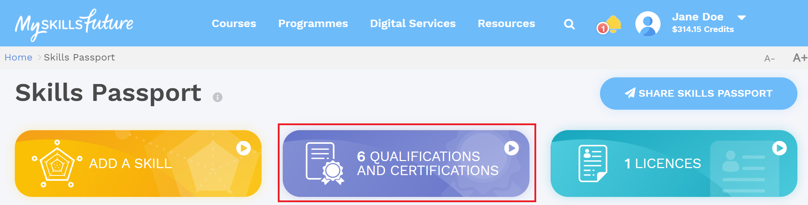

# Retrieving .opencert from MySkillsFuture Portal

1. Head to https://www.myskillsfuture.gov.sg/ and login

2. Click on your name to reveal the dropdown menu and select `Skills Passport`

3. Select the `Qualifications and Certifications` card

4. Select a certificate from the list

5. Download the .opencert file

6. Head to https://www.opencerts.io/